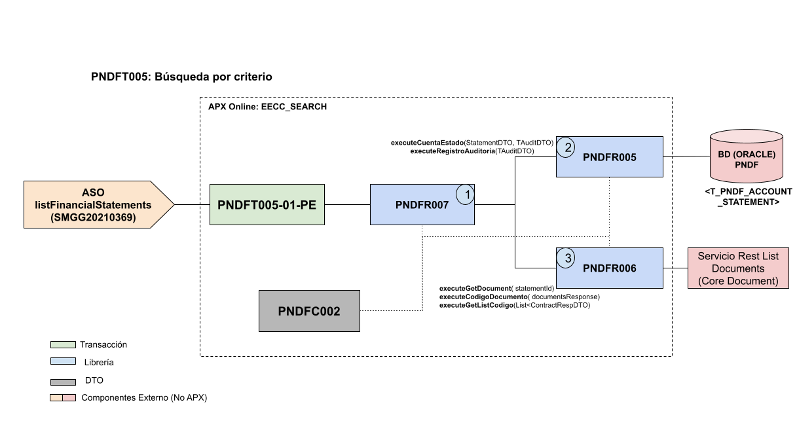

# 
# Recurso APX Online: eecc_search

El objetivo de este documento es proveer informacion relacionada de las transacciones online dentro de este recurso que ha sido implementado sobre la Arquitectura APX y desplegado a traves de la Consola Ether.

## 1. Transacciones
En este apartado se detallan todas las transacciones implementadas.

### 1.1. Transaccion PNDFT005
- Descripcion: Transacción que lista estados financieros.
- Tipo de Origen: Servicio de Negocio
- API de Negocio: [financial-statements](https://catalogs.platform.bbva.com/apicatalog/business/apis/apis-products-financialstatements/versions/global-1.14.0/resources/financialstatementsapifinancialstatementsv1/)
- SMC del Servicio ASO: [listFinancialStatements](https://docs.google.com/spreadsheets/d/1tW7NgrhemnapgKrbRrUAs_qyjeEEEPjDHY4FoTFGFWs/edit?usp=sharing)
- Usuario Transaccional: ​UCQGZIPD, ZG13001 , Modelo Usuario Final, ​ZG13003.
- Version: 01-PE
- Respuestas:
    - Codigo Respuesta: Http Code: 200, Severity: OK
    - Codigo Respuesta: Http Code: 204, Severity: OK
    - Codigo Respuesta: Http Code: 409, Severity: ENR
    - Codigo Respuesta: Http Code: 400, Severity: ENR

## 2. DTOs:
En este apartado se detallan todas las clases DTOs utilizadas en este recurso.

- **ContractDTO**: Clase que representa el id de la tarjeta y del tipo de tarjeta.
- **ContractRespDTO**: Clase que representa la respuesta de la Transation.
- **BusinessCode**: Clase que representa el business code de la respuesta del Core Document.
- **Categorization**: Clase que representa el categorization de la respuesta del Core Document.
- **Change**: Clase que representa el change de la respuesta del Core Document.
- **ContenInfo**: Clase que representa el contenInfo de la respuesta del Core Document.
- **DocumentInfo**: Clase que representa el documentInfo de la respuesta del Core Document.
- **GeoLocation**: Clase que representa el geoLocation de la respuesta del Core Document.
- **OriginInfo**: Clase que representa el originInfo de la respuesta del Core Document.
- **PreservationInfo**: Clase que representa el preservationInfo de la respuesta del Core Document.
- **SecurityLevelInfo**: Clase que representa el securityLevelInfo de la respuesta del Core Document.
- **Data**: Clase que representa un objeto del Core Document.
- **GetDocumentsResponse**: Clase que representa la lista de objetos de Core Document.
- **ConfigEnum**: Clase que representa el consjunto de constantes.
- **ConstantStatement**: Clase que representa variables constantes.
- **Util**: Clase que representa metodos simples.
- **ProductTypeDTO**: Clase que representa el id del tipo de producto.
- **StatementDTO**: Clase que representa el request de entrada.
- **TAuditDTO**: Clase que representa la tabla auditoria.

## 3. Librerias

### 3.1. Librerias Internas
En este apartado se detallan todas las librerias internas creadas para implementar la logica de negocio de las transacciones.

#### 3.1.1. Libreria PNDFR005
Esta Librería APX tiene como objetivo generar una simulacion de prestamos de consumo para clientes y no clientes. Los tipos de prestamos implementados son los siguientes: Cafae, Libre Disponibilidad y Estudios.
List<ContractRespDTO> executeCuentaEstado(StatementDTO statementDTO, TAuditDTO auditoria);
String executeRegistroAuditoria(TAuditDTO auditoria);
-  **Metodo 1 executeCuentaEstado(StatementDTO statementDTO, TAuditDTO auditoria)**: Este método permite obtener una lista de estados de cuenta disponibles segun la solicitud, agrega en la tabla T_PNDF_ACCT_STATEMENTS_AUDIT para la busqueda simple y . 
    - Avisos a retornar: PNDF10000001 
-  **Metodo 2 executeRegistroAuditoria(TAuditDTO auditoria)**: Este método permite registrar un registro en la tabal auditoria.
    - Avisos a retornar: PNDF10000002 

#### 3.1.2. Libreria PNDFR006
Esta Librería APX tiene como objetivo generar una simulacion de prestamos de consumo para clientes y no clientes. Los tipos de prestamos implementados son los siguientes: Cafae, Libre Disponibilidad y Estudios.
GetDocumentsResponse executeGetDocument(String statementId);
String executeCodigoDocumento(GetDocumentsResponse documentsResponse);
List<ContractRespDTO> executeGetListCodigo(List<ContractRespDTO> listContractRespDTO);

-  **Metodo 1 executeGetDocument(String statementId)**: Este método permite obtener objetos GetDocumentsResponse.
    - Avisos a retornar: PNDF10000002
-  **Metodo 1 executeCodigoDocumento(GetDocumentsResponse documentsResponse)**: Este método permite obtener el código en el Core Document de un objeto GetDocumentsResponse del Core Document.
    - Avisos a retornar: PNDF10000002
-  **Metodo 1 executeGetListCodigo(List<ContractRespDTO> listContractRespDTO)**: Este método permite obtener una lista de objetos de tipo StatementDTO donde el id corresponde al identificador del Core Document en los casos de busqueda simple y en reenvio de estados de cuenta, en los demas mas casos el id es el id de la base de datos.
   - Avisos a retornar: PNDF10000002
    
#### 3.1.3. Libreria PNDFR007 
- **executeEECCresponse(StatementDTO statementDTO, TAuditDTO tAuditDTO)**: Este método permite orquestar las librerias PNDFR005 y PNDFR006 y devuelve una lista de ContractRespDTO.
    - Avisos a retornar: PNDF10000009
    
### 3.2. Librerias Externas
(no aplica)

## 4. Mensajes de Error y Avisos
En este apartado se detallan los distintos mensajes de error que retornan las librerias de acuerdo a los casos y logica de negocio implementada.

- **Advise PNDF10000001**: No se encontraró el estado de cuenta en el periodo ingresado.
- **Advise PNDF10000002**: Error interno vuelvalo a intentarlo.
- **Advise PNDF10000009**: Son datos obligatorios CustomerID, ContractID y ProductTypeId .

# 5. Diagrama de Componentes
En este apartado se grafican todos los componentes involucrados en el funcionamiento del recurso.

# 6. Versiones del Componente
En este apartado se detalla un historial de cambios o *changelog* por cada version implementada del recurso.

- **Versión 0.1.19**: Esta versión permite obtener el listado de estados de cuentas para tarjetas de crédito (versión inicial).
- **Versión 1.0.2**: Esta versión permite obtener el listado de estados de cuentas para adquirencia y cuentas.
- **Versión 1.0.7**: Cambio de id de core document a contentLocator.
- **Versión 1.1.2**: Esta version acepta el product type INVESTMENT_FUNDS.
- **Versión 1.1.10**: Esta version hace un ajuste en las querys de busqueda.
- **Versión 2.0.0**: Esta version permite obtener el listado de estados de cuentas para BOLSA.

